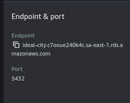

## Deploying the application to AWS

### 1.Deploying the Dotnet application to Lambda
This service is a dotnet 6.0 API that contains the core logic of the application.

In this example, we are deploying an already existing API to Lambda using the [Lambda-Lith pattern](https://github.com/cdk-patterns/serverless/tree/main/the-lambda-trilogy).

- The [aws-lambda-tools-defaults.json](./server/Api/aws-lambda-tools-defaults.json) is already configured, and we already added a HTTP trigger in program.cs
    
```csharp
// Program.cs
var builder = WebApplication.CreateBuilder(args);

builder.Services.AddAWSLambdaHosting(LambdaEventSource.HttpApi);
````

- Create an [**RDS instance on the same VPC as the Lambda**](https://docs.aws.amazon.com/AmazonRDS/latest/UserGuide/lambda-rds-connect.html)

- Assure your [**Lambda have access to internet and outside resources**](https://docs.aws.amazon.com/lambda/latest/dg/configuration-vpc-internet.html)

- Install the CLI Lambda tools:
```shell
cd server
dotnet tool install -g Amazon.Lambda.Tools
```

- Deploy the application to your created Lambda : 
```shell
cd Api
dotnet lambda deploy-function <lambda-name>
```
> When prompted about the IAM Role, chose one that has access to SQS and RDS services.

- Access the healthCheck on your browser to make sure everything is working fine:

```shell
curl https://<function-url>/health
```
### 2.Deploying the Payment service to EC2

This service is a simple Spring Boot application that consumes SQS messages, send emails and informs the client about payments
deadlines.

Create both the [EC2 and the RDS instance on the same VPC](https://docs.aws.amazon.com/AWSEC2/latest/UserGuide/tutorial-ec2-rds-option2.html). 

Build the Jar locally and dockerize it, configuring the application.properties according to RDS instance configurations , in this example the connection string would be `jdbc:postgresql://ideal-city.c7ooue240k4c.sa-east-1.rds.amazonaws.com:5432/ideal`, note we are also pushing the image to dockerhub


> Remember configuring the username, password and the database according to the ones created in the RDS instance.

```shell
# Assure you are in the project root, use jvm 17 to build the jar
./gradlew clean build -x test
#docker build -t f136pix/payment-service:latest .  
docker build -t username/payment-service:latest .  
docker login
#docker push f136pix/payment-service:latest
docker push username/payment-service:latest
```

- Connect to the EC2 instance :
```shell
ssh -i "path/to/id/rsa" ec2user@ec2ip
```

- Install docker, nano and PSQL in the EC2 instance:
```shell
sudo apt install -y docker.io postgresql-client nano
```

- Test your connection to the RDS instance:
```shell 
# ex: psql -h ideal-city.c7ooue240k4c.sa-east-1.rds.amazonaws.com -U postgres -d ideal
psql -h <RDS_ENDPOINT> -U <USERNAME> -d <DATABASE_NAME>
```

- Create the AWS credentials file in the EC2 instance:
```shell
mkdir ~/.aws && touch ~/.aws/credentials && nano ~/.aws/credentials
```

Add you AWS credentials to the file:
```text
[default]
aws_access_key_id = YOUR_ACESS_KEY
aws_secret_access_key = YOUR_SECRET_ACCESS_KEY
region =  YOUR_REGION
```

Pull and run the service Docker image
```shell
sudo docker login
#docker pull f136pix/payment-service:latest
sudo docker pull username/payment-service:latest
#docker run -d -p 8080:8080 f136pix/payment-service:latest
sudo docker run -d -p 80:8080 -p 443:8080 f136pix/payment-service:latest
``` 

- Try accessing the healthCheck in your browser to confirm everything is working fine:

```shell
curl <public-ipv4>/health 
```

>There is no need of migrating the tables since spring-boot already manages it.

## Running the application locally

- Clone the repo
```shell
cd ~/Desktop
git clone https://github.com/f136pix/ideal-city.git
cd ideal-city
```

- Run the db's and open the node-ports using the makefile: 
```shell
make run-dbs
make open-ports
```

- Configure the connection string on [appsettings.json](./server/Api/appsettings.json) and [application.properties](./payment_service/src/main/resources/application.properties).
```json
{
  "ConnectionStrings": {
    "DefaultConnection": "Host=localhost;Port=30007;Database=ideal-city;Username=admin;Password=paS5w0rD!"
  }
}
```
```properties
 spring.datasource.url=jdbc:postgresql://localhost:30009/ideal
 spring.datasource.username=admin
 spring.datasource.password=paS5w0rD!
```

TODO: Create the make commands and k8 it.
- Build and run the DockerFiles using Make:
```shell
make run-dotnet
make run-spring
```

## C# and Ef Core tips n tricks

### TimeStamps Generation

You can have the timestamps generated by an Interceptor.
To achieve this, you can create a IHasTimeStamp interface

```csharp
// IHasTimeStamp.cs
    public interface IHasTimeStamps
    {
        public DateTime CreatedAt { get; }
        public DateTime UpdatedAt { get; }

        public void SetCreatedAtNow();

        public void SetUpdatedAt();
    }
```

And implement it in every entity you want to have timestamps *(or directly in the Entity class)*

````csharp
// Entity.cs
    
public abstract class Entity<TGuid> : IHasDomainEvents, IHasTimeStamps
    where TGuid : notnull
    { ... ...
    // TimeStamps
    public DateTime CreatedAt { get; private set; }
    public DateTime UpdatedAt { get; private set; }

    public void SetCreatedAtNow()
    {
        CreatedAt = DateTime.Now; // May need using custom TimeProvider / Adjusting via FluentApi
    }

    public void SetUpdatedAt()
    {
        UpdatedAt = DateTime.Now;
    }
   
    ... ... }
````

> The format may vary according to which DB you are using. For instance, PostgreSQL (PGSQL) must be UTC.

And then, you can have a Interceptor that provides an operation like this

````csharp
private Task SaveTimeStamps(DbContext? dbContext)
    {
        if (dbContext is null)
        {
            return Task.CompletedTask;
        }

        // Gets all IHasTimeStamp Created || Updated
        var entries = dbContext.ChangeTracker.Entries()
            .Where(e => e.Entity is IHasTimeStamps &&
                        (e.State == EntityState.Added || e.State == EntityState.Modified));

        foreach (var entity in entries)
        {
            ((IHasTimeStamps)entity.Entity).SetCreatedAtNow();

            if (entity.State == EntityState.Added)
            {
                ((IHasTimeStamps)entity.Entity).SetCreatedAtNow();
            }
        }

        return Task.CompletedTask;
    }
````

> Full implementation in *Infrastructure/Interceptors/SaveTimeStampInterceptor.cs*

### Rich domain Model

It`s usually easier to maintain the integrity of your application having a rich domain models instead of anemic ones, concentrating modification operations on the domains: 

```csharp
  // Example :
  public ErrorOr<Updated> UpdateSubscription(Subscription subscription)
    {
        if (subscription.SubscriptionType.Value == SubscriptionType.Basic.Value)
        {
            return Error.Conflict("Can't update to Free subscription type");
        }

        Subscription = subscription;
        SubscriptionId = Subscription.Id;

        var result = subscription.AddUser(this);
        if (result.IsError) return result.Errors;
        
        subscription.AddDomainEvent(new SubscriptionUpdated(subscription));

        return Result.Updated;
    }
```


### Keeping track of Ids

You can keep track of the many belonging Ids of an entity either by retrieving them the from the target entity when
requested:

```csharp
// City.cs
    private List<CityReviewId>? _reviewsIds => GetReviewsIds();
    public IReadOnlyList<CityReviewId>? ReviewsIds => _reviewsIds.AsReadOnly();

    // helper method
     private List<CityReviewId> GetReviewsIds()
    {
        if (Reviews == null) return null;
        // return Reviews.Select(r => r.Id).ToList();
        
        var reviewsIds =
            from review in Reviews
            select review.Id;

        return reviewsIds.ToList();
    }
```

````csharp
// CityConfiguration.cs
    builder.Ignore(c => c.ReviewsIds);
    // # you may also need defining HasConversion for the CityReviewId on its own configuration
````

> This method does not require additional configuration on the Ef Configuration.

Or you can have a field/column that formats and saves them in the database in a single string.

```csharp
// City.cs
    private List<CityReviewId>? _reviewIds = new();
    public IReadOnlyList<CityReviewId>? ReviewsIds => _reviewsIds.AsReadOnly();
```

````csharp
// CityConfiguration.cs
    builder.Property(c => c.ReviewIds)
        .HasListOfIdsConverter();
        
    builder.Metadata.FindNavigation(nameof(City.ReviewIds))!
        .SetPropertyAccessMode(PropertyAccessMode.Field);
````

````csharp
// HasListOfIdsConverter.cs
    public static PropertyBuilder<List<Guid>> HasListOfIdsConverter(this PropertyBuilder<List<Guid>> propertyBuilder)
    {
        var converter = new ValueConverter<List<Guid>, string>(
        v => string.Join(";", v.Select(id => id.Value)),
        v => v.Split(';', StringSplitOptions.RemoveEmptyEntries).Select(value => CityReviewId.Create(Guid.Parse(value))).ToList());
        propertyBuilder.HasConversion(converter);

        return propertyBuilder;
    }
````

> If your application heavily relies on these Ids, the second approach might be more efficient, since it does
> not lazy loads the Ids and does all the retrieving in one go.

### Add Fleunt Validation to MediatR pipeline behavior

You can add FluentValidation to the MediaTR pipeline by creating a behavior that validates the request before they are
processed by its handler.

```csharp
// CreateCityCommandValidator.cs
public sealed class CreateCityCommandValidator : AbstractValidator<CreateCityCommand>
{
    public CreateCityCommandValidator()
    {
        RuleFor(x => x.Name)
            .NotEmpty().WithMessage("Name is required")
            .Must(name => name != null).WithMessage("Name must be a string");

        RuleFor(x => x.CountryId)
            .NotEmpty().WithMessage("Country Id is required")
            .Matches(@"^[a-fA-F0-9]{8}-[a-fA-F0-9]{4}-[a-fA-F0-9]{4}-[a-fA-F0-9]{4}-[a-fA-F0-9]{12}$")
            .WithMessage("Country Id should contain 32 digits with 4 dashes (xxxxxxxx-xxxx-xxxx-xxxx-xxxxxxxxxxxx)");
    }
}
```

You can have a pipeline behavior that interacts with IRequests :

```csharp
// ValidationBehavior.cs
    
public class ValidationBehavior<TRequest, TResponse> : IPipelineBehavior<TRequest, TResponse>
    where TRequest : IRequest<TResponse>

    ...
    
    public async Task<TResponse> Handle(TRequest request, RequestHandlerDelegate<TResponse> next,
        CancellationToken cancellationToken)
    {
        var validatorType = typeof(IValidator<>).MakeGenericType(typeof(TRequest)); 
        var _validator = _serviceProvider.GetService(validatorType) as IValidator<TRequest>; // Get the validator from the dependency services container

        
        if (_validator is null)
        {
            Console.WriteLine($"No validator found for {typeof(TRequest)}");
            return await next();
        }
        
        var validationResult = await _validator.ValidateAsync(request, cancellationToken);
        if (validationResult.IsValid)
        {
            return await next();
        }

        List<Error> errors = validationResult
            .Errors
            .Select(error => Error.Validation(description: error.ErrorMessage, code: error.PropertyName))
            .ToList();

        return (dynamic)errors;
    }
```

> Full implementation in [Application/Common/Behaviors/ValidationBehavior.cs](./server/Application/_Common/Behaviors/ValidationBehavior.cs)

And add it to the services container with MediatR

```csharp
 services.AddMediatR(options =>
        {
            options.RegisterServicesFromAssembly(typeof(DependencyInjection).Assembly);
            options.AddOpenBehavior(typeof(ValidationBehavior<,>));
            
            // options.AddBehavior<IPipelineBehavior<CreateCityCommand, ErrorOr<City>>, CreateCityCommandBehavior>();
        }); 
```